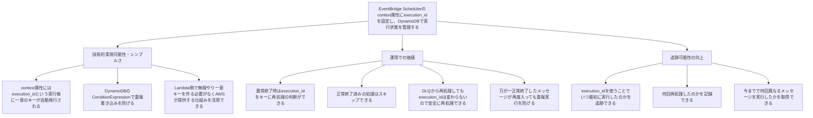

# EventBridge Scheduler context属性で安全な再処理を実現する方法 - ドラフト

## OPQ分析

### 想定読者
- 「EventBridge Scheduler 再処理」「EventBridge コンテキスト属性」で検索するITアーキテクトやエンジニア
- 実装手順が必要なエンジニア
- アーキテクチャ設計の根拠や理論が必要なアーキテクト

### 目標（Objective）
EventBridge Schedulerのコンテキスト属性を使ってメッセージを一意に識別し、安全に再処理できるアーキテクチャを構築したい

### 問題（Problem）
- EventBridge Schedulerでコンテキスト属性をどう活用するか分からない
- 再処理の副作用（重複実行）を避ける具体的な実装方法が分からない
- EventBridge+SQS+Lambda+DynamoDBでの実装例が見つからない
- アーキテクチャ設計の理論的根拠やよくある失敗パターンが分からない

### 質問（Question）
「EventBridge Schedulerで安全な再処理を実現するにはどうすればいい？実装例も知りたい」

## 記事のピラミッド構造

## 補足情報

### 実装関連
- EventBridge+SQS+Lambda+DynamoDBでend-to-endの冪等性を実現できる
- CloudFormationテンプレートで再現可能な環境を構築できる

### よくある失敗パターン
- `<aws.scheduler.execution-id>`をタイプミスするとただの文字列として認識され、毎回同じキーが発行される
- 重複キーにSQSのメッセージIDを指定すると、DLQからの再実行や重複配信で毎回別のIDになり重複検知できない

## 記事で提供する内容

### エンジニア向け
- EventBridge+SQS+Lambda+DynamoDBのCloudFormationテンプレート
- 実装コード例
- 動作確認手順

### アーキテクト向け
- システム概念図
- 理論的根拠（冪等性、一意性保証）
- よくある失敗例と対処法

## 記事構成案

1. **はじめに**（結論先出し）
2. **EventBridge Schedulerのcontext属性とは**（技術的実現可能性）
3. **実装例：EventBridge+SQS+Lambda+DynamoDB**（実装方法）
4. **運用での活用方法**（再処理判断・DLQ連携）
5. **追跡可能性とモニタリング**（運用価値）
6. **よくある失敗パターンと対処**（失敗回避）
7. **まとめ**