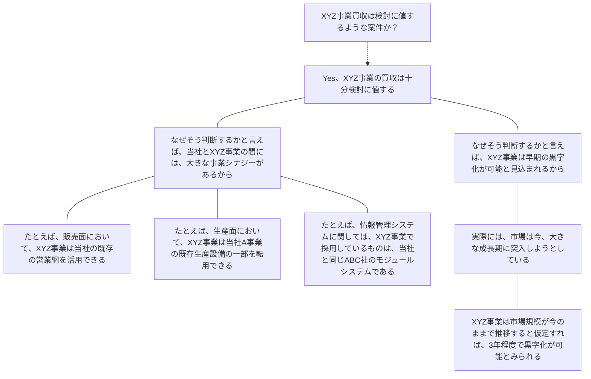

```mermaid
    flowchart TB
        question -.-> message
        message --- reason2
        message --- reason1
        question[XYZ事業買収は検討に値するような案件か？]
        message[Yes、XYZ事業の買収は十分検討に値する]
        reason1[なぜそう判断するかと言えば、当社とXYZ事業の間には、大きな事業シナジーがあるから]
        reason1-1[たとえば、販売面において、XYZ事業は当社の既存の営業網を活用できる]
        reason1-2[たとえば、生産面において、XYZ事業は当社A事業の既存生産設備の一部を転用できる]
        reason1-3[たとえば、情報管理システムに関しては、XYZ事業で採用しているものは、当社と同じABC社のモジュールシステムである]

        reason1 --- reason1-1
        reason1 --- reason1-2
        reason1 --- reason1-3       

        reason2[なぜそう判断するかと言えば、XYZ事業は早期の黒字化が可能と見込まれるから]
        reason2-1[XYZ事業は市場規模が今のままで推移すると仮定すれば、3年程度で黒字化が可能とみられる]
        reason2-2[実際には、市場は今、大きな成長期に突入しようとしている]
        reason2 --- reason2-2
        reason2-2 --- reason2-1
```